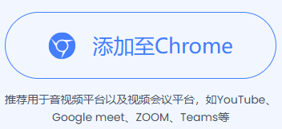
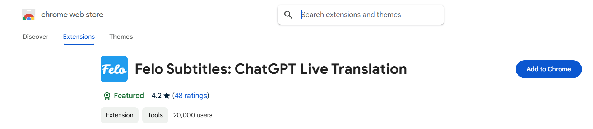
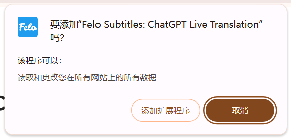
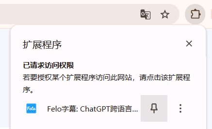
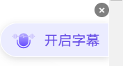
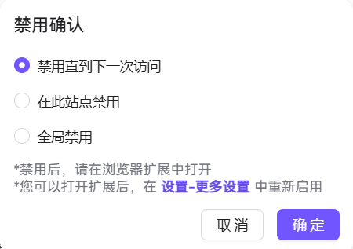

# 浏览器安装（Chrome插件版）

> ⚠️ **注意**：Chrome 插件版仅支持 **Felo 海外版**，不支持国内版。

通过下述步骤，可以将Felo字幕作为浏览器插件安装到PC端的浏览器里。（chrome浏览器）

1.在官网点击“添加至Chrome”按钮。

<figure><figcaption></figcaption></figure>

2.在谷歌“chrome web store”页面确认后，点击“Add to Chrome”按钮。

<figure><figcaption></figcaption></figure>


Chrome出现如下提示时，请选择“添加扩展程序”。如果选择“取消”则无法安装插件。\



3.安装完成以后，会跳转到欢迎页面，然后按照页面指示操作固定扩展即可使用。\

4.在网页的右边栏会有一个话筒的小图标，鼠标置于其上时会显示“开启字幕”后，即可使用。\
          \
5.为了不影响其他网站的使用体验，可以通过点击右上角的“X”图标来设置禁用模式。

<figure><figcaption></figcaption></figure>

