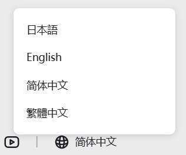
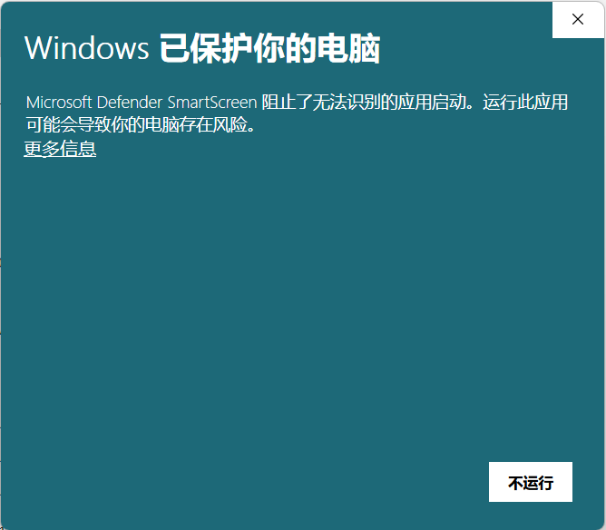
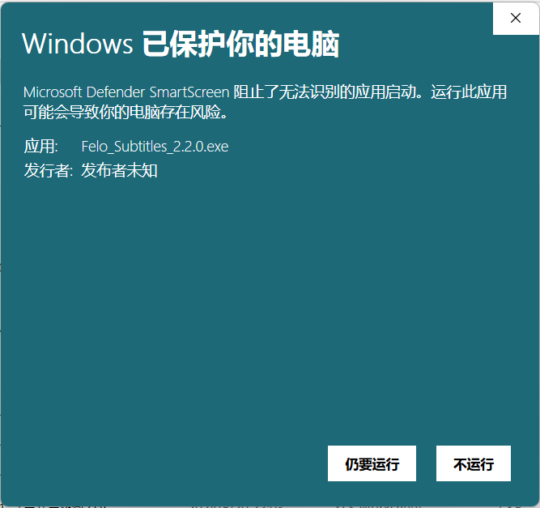
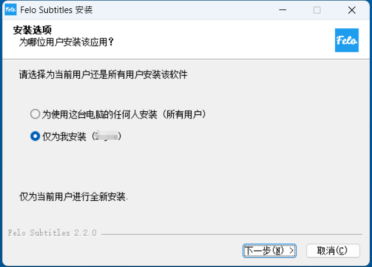
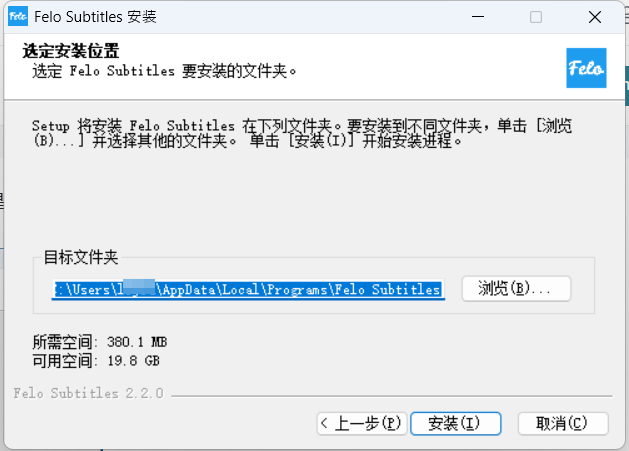
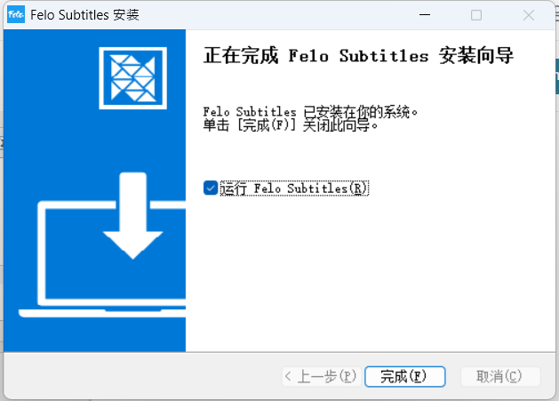

# 个人电脑安装（winpc版）

通过下述步骤，可以将Felo字幕安装到个人电脑上（windows操作系统）。

1.访问Felo字幕官网。（[https://subtitles.felo.cc/](https://subtitles.felo.cc/)）


网站的语言不是您想要的语种的话，请在页面的右下方语言变换处选择您的语言。\



2.下载Felo字幕的安装文件。

点击网站的下载图标下载Felo字幕的安装文件。\

3.找到已下载的可执行文件，双击执行。(默认在windows用户的download文件夹）\


如果应用程序被Windows的防火墙拦截，请点击“更多信息”后选择“仍要运行”\



4.选择安装用户（为所有人，还是自己当前登录账号安装软件），默认仅为当前登录账号安装。

<figure><figcaption></figcaption></figure>

5.选择安装路径，点击“安装”按钮。\
（默认安装路径：C:\Users\\**UserID**\AppData\Local\Programs\Felo Subtitles）

<figure><figcaption></figcaption></figure>

6.等待安装完成后，点击完成按钮。（默认运行程序，也可以双击桌面图标启动）

<figure><figcaption></figcaption></figure>

