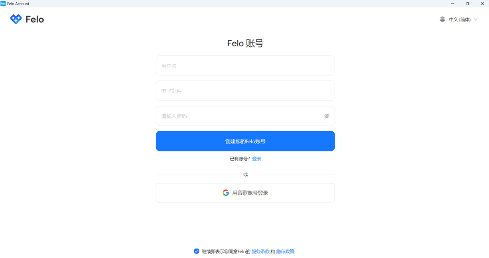
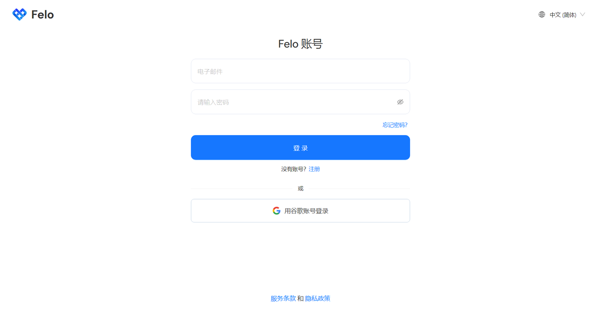
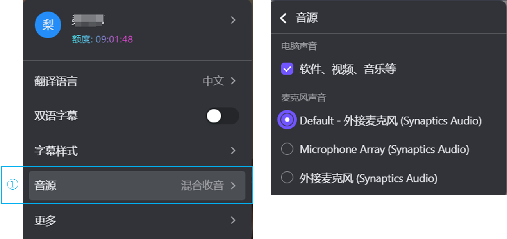
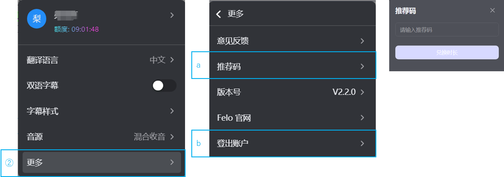

# Felo字幕使用方法（PC版）

1.启动应用。（双击桌面图标等方式）

<figure><figcaption></figcaption></figure>

2.注册方法：\
未登录状态不可以使用（第一次注册会有30分钟免费试用时间）\
可以通过谷歌邮箱免邮箱认证快速注册，或者通过个人邮箱注册Felo账号。\

<figure><figcaption></figcaption></figure>

3.登录方法：\
点击登录按钮，通过注册时使用的个人邮箱或者谷歌邮箱登录进入软件即可使用。

<figure><figcaption></figcaption></figure>

<figure><figcaption></figcaption></figure>

4.使用方法参照[Felo字幕使用方法（插件版）](markdown/)部分。\
这里仅说明设定菜单的差异部分。\
在PC版的设定菜单里，多了一个“音源”设定。\
默认选中“电脑声音：软件，视频，音乐等”，“default-外接麦克风”\
这样既能翻译电脑里的声音，也能拾取外部音源。

<figure><figcaption></figcaption></figure>

5.更多\
推荐码：可以通过邀请朋友注册使用来获得推荐码兑换时长。\
登出账户：退出Felo字幕。

<figure><figcaption></figcaption></figure>
