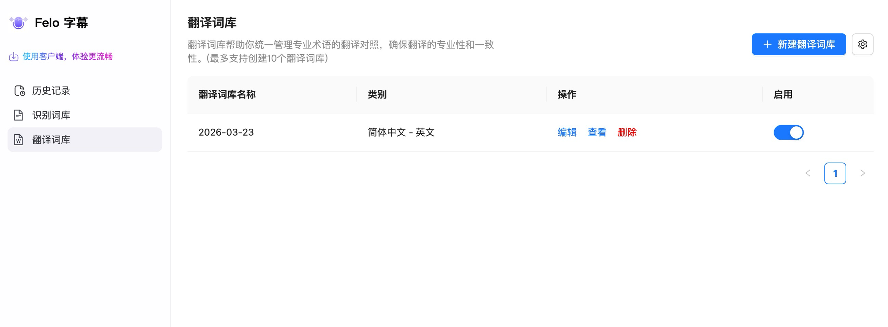
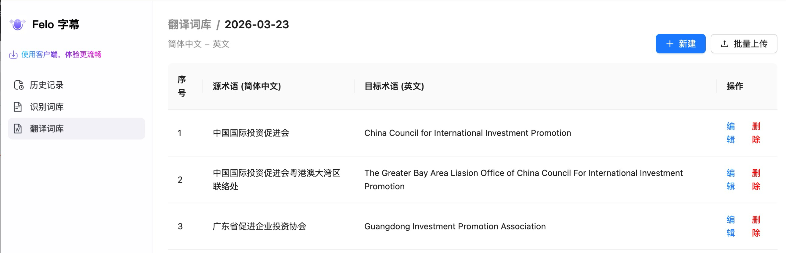
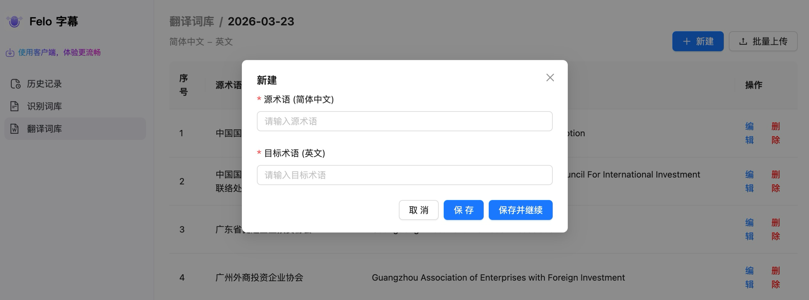
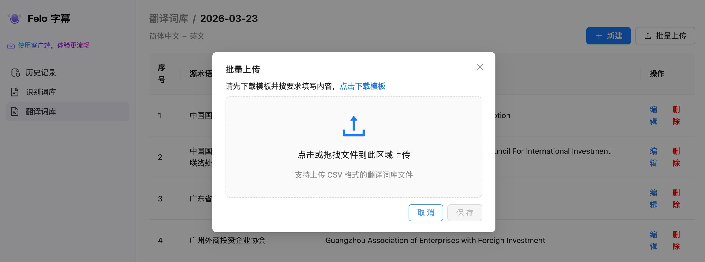

# 翻译词库

「翻译词库」用于统一管理专业术语在源语言和目标语言之间的对照关系，确保同一术语在所有翻译中保持一致。**最多支持创建 10 个翻译词库**。

<figure><figcaption>
翻译词库列表
</figcaption></figure>

列表页可对每个词库进行**编辑 / 查看 / 删除**，并通过右侧开关控制启用状态。点击「+ 新建翻译词库」可创建一个新的词库。

## 词库详情

点击任一词库进入详情页，可看到该词库下所有源术语与目标术语的对照表：

<figure><figcaption>
词库详情：源术语 → 目标术语对照表
</figcaption></figure>

每行包含序号、源术语（如 简体中文）、目标术语（如 英文），以及编辑/删除操作。

## 新建术语

点击「+ 新建」按钮，弹出新建对话框：

<figure><figcaption>
新建术语对话框
</figcaption></figure>

* **源术语**与**目标术语**均为必填项。
* **保存**：保存当前条目并关闭对话框。
* **保存并继续**：保存当前条目并清空表单，方便连续录入多条术语。

## 批量上传

如需一次性导入大量术语，点击「批量上传」按钮：

<figure><figcaption>
批量上传 CSV 文件
</figcaption></figure>

* 先点击「**点击下载模板**」获取标准 CSV 模板，按照模板格式填写后再上传。
* 支持点击或拖拽上传，文件格式为 **CSV**。
* 上传后预览无误再点「保存」即可完成批量导入。
