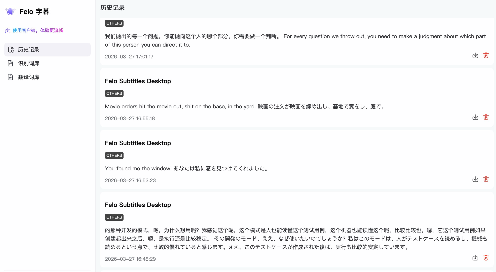
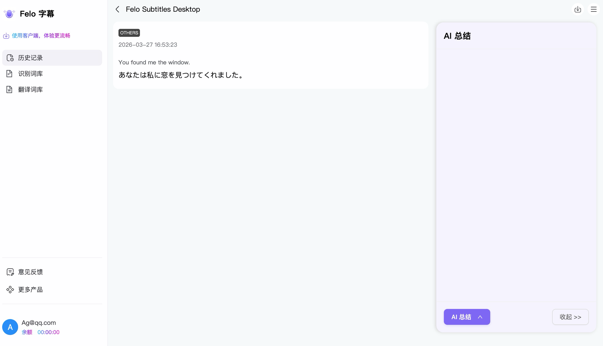
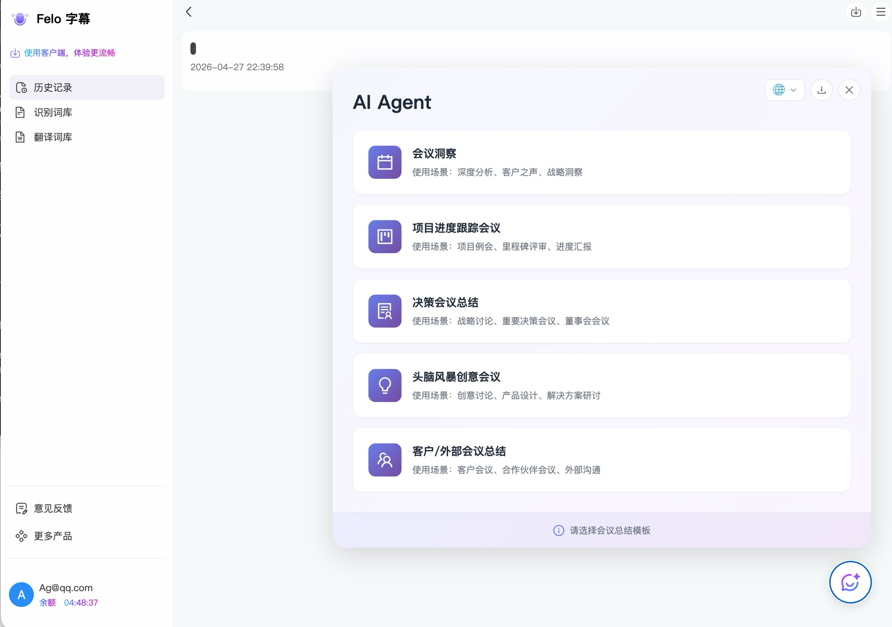
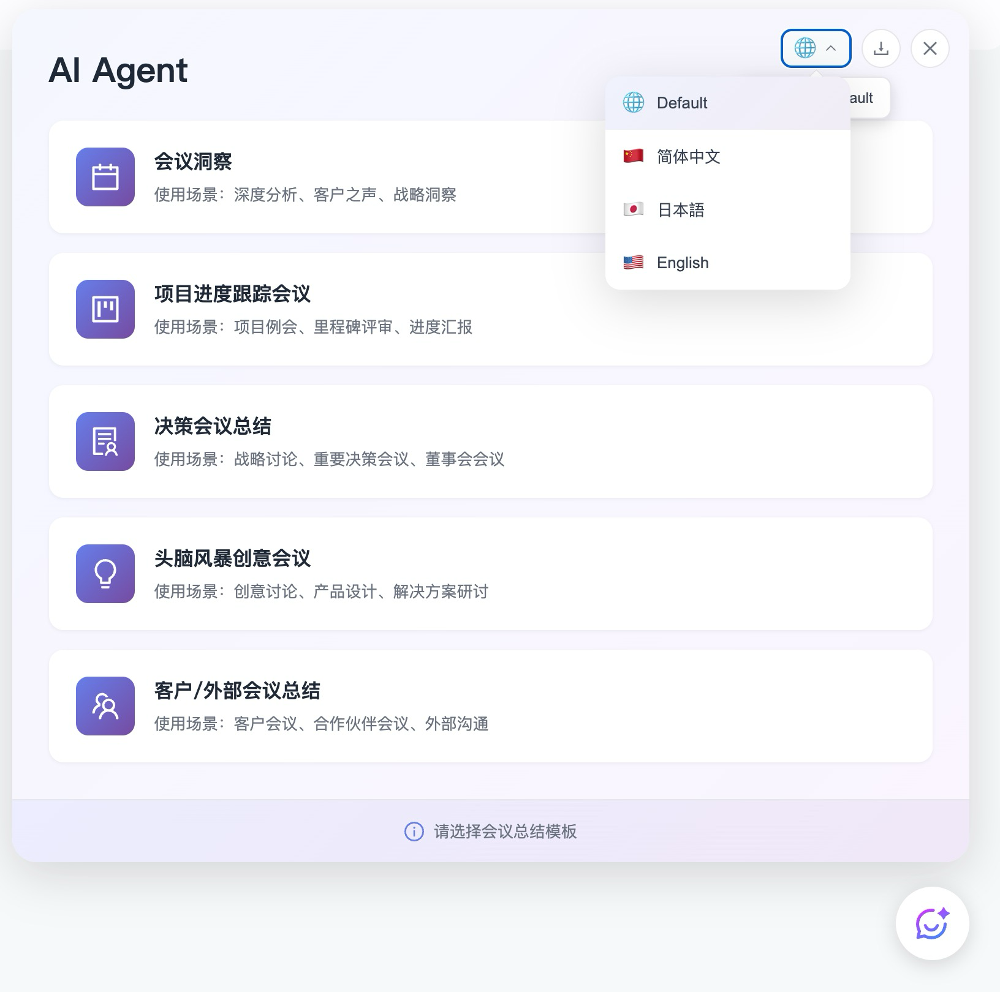

# 历史记录

点击「历史记录」按钮即可进入Felo字幕的web管理页面。左侧菜单包含 **历史记录**、**识别词库**、**翻译词库** 三个模块，本页介绍「历史记录」。

## 记录列表

「历史记录」用于查看和管理所有翻译会话。

<figure><figcaption>
历史记录一览
</figcaption></figure>

* **标题**：翻译启动时自动生成（例如翻译YouTube视频时，标题与网页标题一致）。无标题的记录显示为空。
* **来源标签**：每条记录会标注来源（如 `OTHERS`），用于区分不同的翻译场景。
* **翻译内容**：展示该会话首条翻译的原文和译文，方便快速识别。
* **时间戳**：翻译开始的日期和时间。
* **下载按钮（⬇）**：将该条翻译记录的全部内容导出为 txt 文件。
* **删除按钮（🗑）**：删除该条翻译记录（不可恢复）。

## 记录详情

点击任意一条记录可进入详情页，查看完整的双语对照内容，并可使用右侧「AI 总结」对整段会话进行智能摘要。

<figure><figcaption>
历史记录详情页（含 AI 总结）
</figcaption></figure>

## AI Agent — 会议总结模板

进入会议详情页后，可调用「**AI Agent**」根据不同会议场景生成结构化总结。点开后会弹出模板选择面板，目前提供 5 种模板：

<figure><figcaption>
AI Agent 模板选择面板
</figcaption></figure>

| 模板 | 使用场景 |
| --- | --- |
| **会议洞察** | 深度分析、客户之声、战略洞察 |
| **项目进度跟踪会议** | 项目例会、里程碑评审、进度汇报 |
| **决策会议总结** | 战略讨论、重要决策会议、董事会会议 |
| **头脑风暴创意会议** | 创意讨论、产品设计、解决方案研讨 |
| **客户/外部会议总结** | 客户会议、合作伙伴会议、外部沟通 |

### 切换输出语言

面板**右上角的地球图标**用于选择 AI Agent 输出总结的语言，点击后弹出下拉菜单：

<figure><figcaption>
右上角语言切换
</figcaption></figure>

可选语言：

* **Default**：跟随系统/原文语言
* **简体中文**
* **日本語**
* **English**

选定模板与语言后，AI Agent 会基于本次会议的转录与翻译内容生成对应风格的总结，并可通过右上角的下载按钮（⬇）导出。
