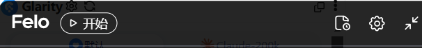
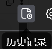
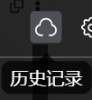
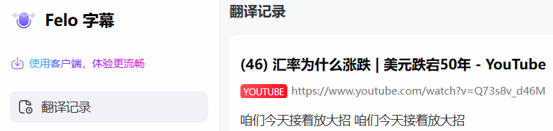
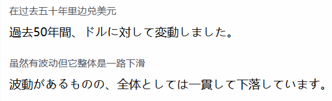
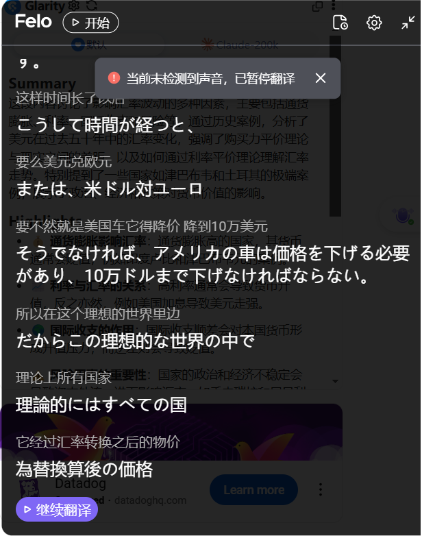
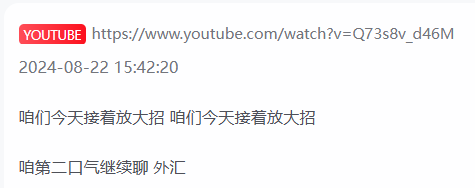
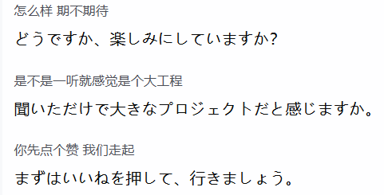

# Felo字幕使用方法（插件版）

> ⚠️ **注意**：Chrome 插件版仅支持 **Felo 海外版**，不支持国内版。

**1.菜单栏介绍**\
①“开始”按钮。\
在暂停翻译的状态下，“开始”按钮可见。点击开始按钮，则开始翻译。\
这个时候“开始”按钮会变成“翻译中”按钮。\
点击“翻译中”按钮则会暂停翻译，变成“开始”按钮。\

<figure><figcaption></figcaption></figure>

&#x20; ②“历史记录”按钮。\
&#x20; 暂停状态的“历史记录”按钮（左图）和翻译状态下的“历史记录”按钮（右图）的图标不同。\
&#x20; 

&#x20; 无论何种状态点击“历史记录”按钮都可以打开Felo字幕网站，看到当前的字幕信息。\
&#x20; 翻译状态下的记录信息则是实时增加的状态。\


字幕的原文可以编辑，手工修正一些翻译错误。


&#x20; ③设置按钮\
&#x20; 参照[设置按钮详细说明](she-zhi-an-niu-xiang-xi-shuo-ming.md)

**2.操作特性：**\
①暂停音视频播放的时候，翻译也会自动暂停。\
点击“继续翻译”按钮，再次播放音视频时则可以继续翻译。

<figure><figcaption></figcaption></figure>

②隐藏模式。\
点击菜单栏的“关闭”按钮，再次打开还能保留上次的翻译记录。\
如果直接关闭翻译的网页则会清除翻译记录。\

③自动识别原语言。\
不需要任何设置可以自动识别原语言。

下图为未选择翻译语言的情况下，翻译字幕自动识别出了中文。\
当选择日语作为第二字幕的时候，原语言中文则以稍小的字体显示在日语上方，日语显示在下方。\

