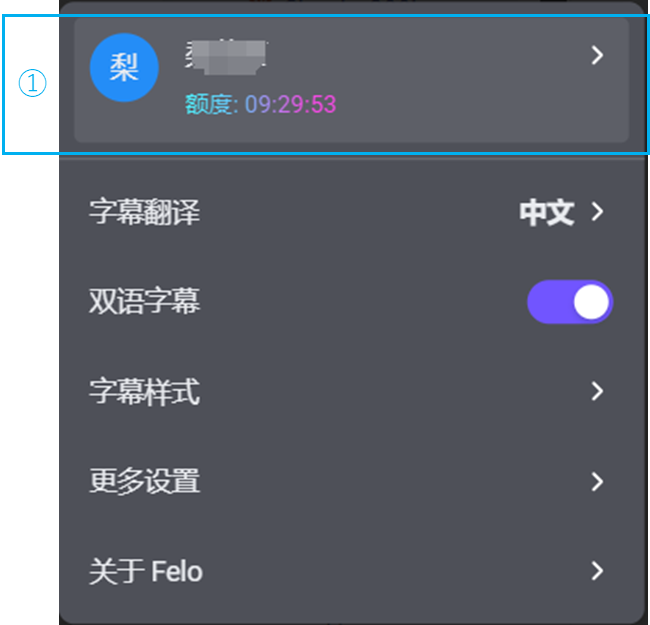
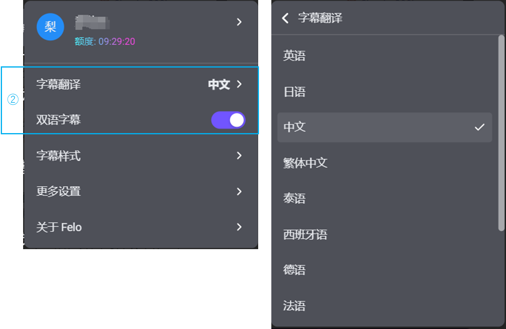
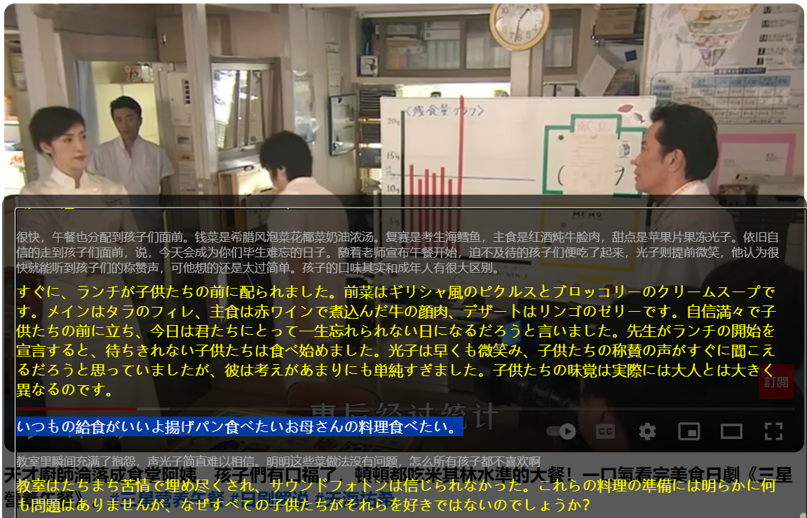
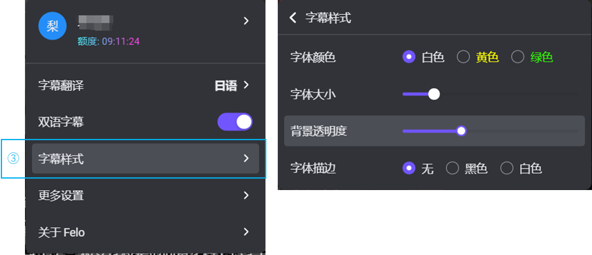
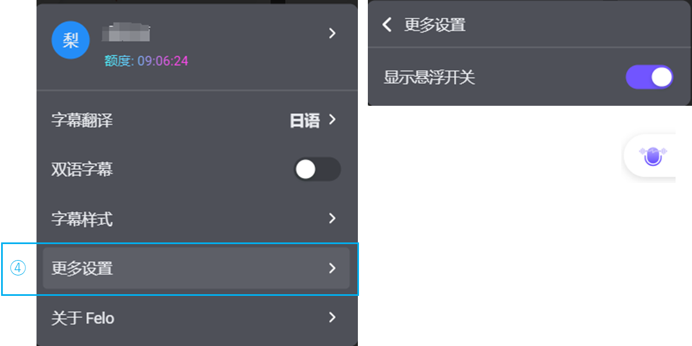
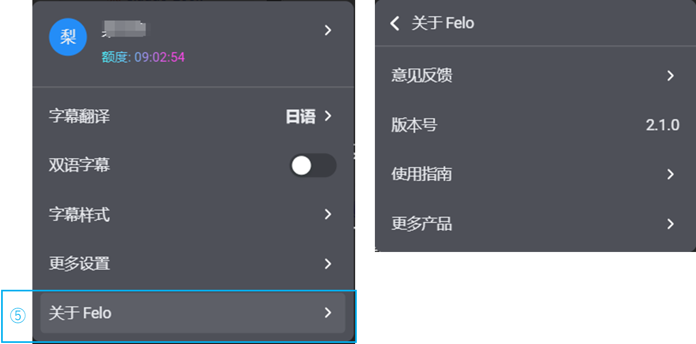

# 设置按钮详细说明

①用户管理菜单\
“额度”之后的时间是当前翻译可用的剩余时间（格式为“时：分：秒”）

<figure><figcaption></figcaption></figure>

②字幕翻译\
默认是安装软件时的系统语言。\
・字幕翻译一共支持12个语种。分别是：英语，日语，中文（繁体中文），泰语，西班牙语，德语，法语，俄语，韩语，葡萄牙语，印地语。\
・在“双语字幕”的打开的前提下，如果音视频的语言和选定的字幕翻译语言一致，则不会出现双语字幕。\
如果音视频的语言和所选语言不一致时，则会出现双语字幕。\
・在“双语字幕”的未打开的前提下，如果音视频的语言和选定的字幕翻译语言一致则记录该语种字幕。\
如果音视频的语言和所选语言不一致时，则会翻译为该语种的字幕。 

<figure><figcaption></figcaption></figure>

比如下面的截图是一段日剧的解说视频，其中部分语言是剧中任务说的日语，在未打开双语字幕的前提下，日语部分会被翻译成中文。（这个时候打开双语字幕也能看到中文上方稍小字体的日语） 

<figure><figcaption></figcaption></figure>

如果是在打开双语字幕的前提下，并且把翻译语言设定为日语，则是下面的效果。\
原语言中文会以稍小字体显示在上方，下方为稍大字体的翻译后的语言。如果视频中突然出现日语，则只有日语部分。

<figure><figcaption></figcaption></figure>

③字幕样式：\
可以设置翻译字体的颜色（默认白色，黄色，绿色）\
字体的大小（默认20，最小12，最大40）\
背景的透明度（默认80%，从最小40%，到60%，80%，最大100%四档可选）\
字体描边（默认无描边，可选黑色或者白色描边）

<figure><figcaption></figcaption></figure>

④更多设置\
可以控制悬浮开关的表示和隐藏。

<figure><figcaption></figcaption></figure>

⑤关于Felo\
意见反馈：链接到Felo字幕的[意见反馈](https://user.felo.me/feedback?from=plugin\&v=2.1.0)网页。\
版本号：当前版本号。\
使用指南：链接到[QA文档](https://docs.google.com/document/d/1xnBXVc57JRuvMEcA0Bpv4Ky2cX-f5W-NxBdqAHhR5XU/edit#heading=h.rlrnz7t774dt)。\
更多产品：链接到[Felo 实时翻译](https://felo.me/zh-CN/translator)的产品主页。

<figure><figcaption></figcaption></figure>

