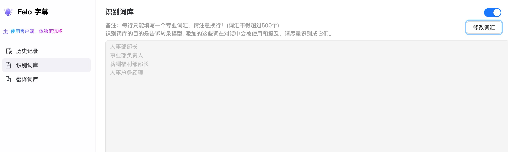

# 识别词库

「识别词库」用于告诉**语音转录模型**有哪些专业词汇会在对话中被使用，从而提升识别准确率，避免人名、职称、产品名等被误识别。

<figure><figcaption>
识别词库配置页
</figcaption></figure>

* **启用开关**（右上角）：控制是否在转录时启用识别词库。
* **修改词汇**按钮：进入编辑模式，添加或删除词汇。
* **词汇填写规则**：每行只能填写一个专业词汇，注意换行；总数不得超过 **500 个**。
* **典型用例**：会议中频繁出现的人名、部门名、职位（如「人事部部长」「事业部负责人」「薪酬福利部部长」「人事总务经理」）。

> 📌 识别词库只影响**转录（识别）**，不直接决定翻译结果。如需统一术语翻译，请使用[翻译词库](fan-yi-ci-ku.md)。
