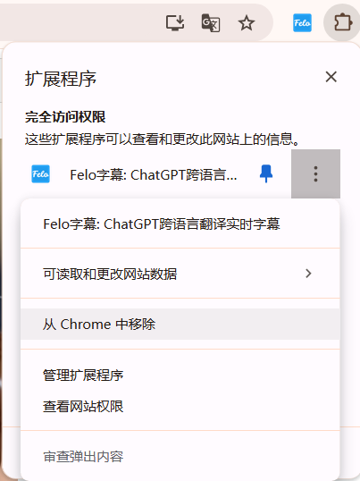
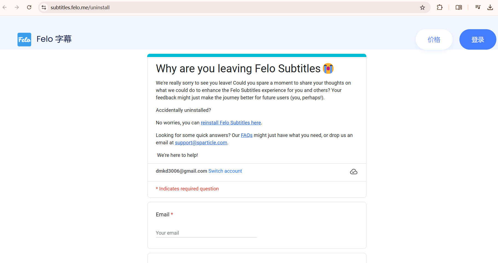

# 插件版卸载方法

如下图，点击“扩展程序”弹出下拉菜单，再点击3个点弹出Felo字幕关联菜单，选择“从Chrome移除”

<figure><figcaption></figcaption></figure>

继续点击“移除”按钮，卸载完成以后迁移到采集意见页面，我们希望能得知用户卸载的原因，以便我们能持续改进产品，让更多用户喜欢用这款软件。

<figure><figcaption></figcaption></figure>

<figure><figcaption></figcaption></figure>
