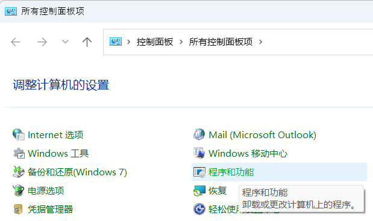
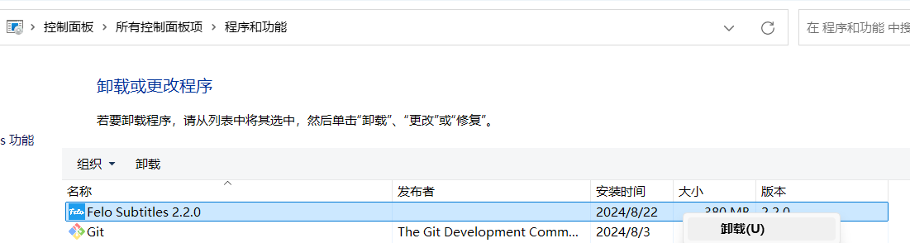
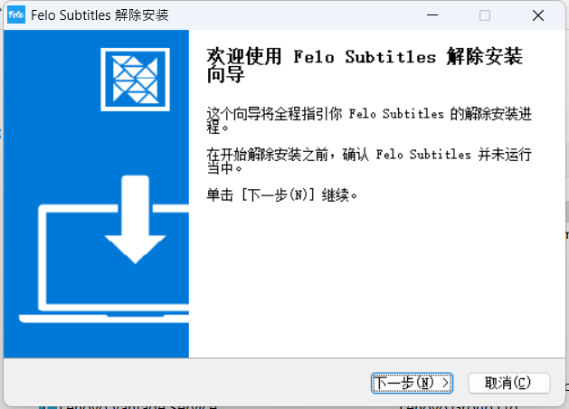
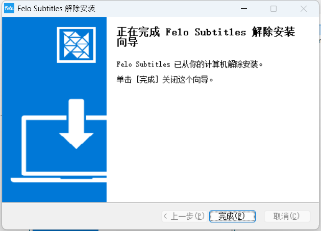

# PC版卸载方法

通过以下步骤可以卸载Felo字幕PC版。\
①打开控制面板，点击“程序和功能”

<figure><figcaption></figcaption></figure>

②选中“Felo Subtitles 2.2.0”，点击鼠标右键弹出菜单，点击“卸载(U)”启动卸载程序。

<figure><figcaption></figcaption></figure>

点击“下一步”按钮，直到卸载完成。

<figure><figcaption></figcaption></figure>

点击“完成”按钮完成卸载。

<figure><figcaption></figcaption></figure>

